<h1 align="center">Building a Brasileirao Analytics Solution with MS Fabric 🟡🟢</h1>

<p align="center"><strong><em>From historical Excel data and a REST API to a Medallion architecture, PySpark transformations, Fabric Warehouse, Direct Lake, Power BI, and GitHub integration.</em></strong></p>

<p align="center">\n  \n</p>

I wanted to build a Microsoft Fabric project. The idea was simple: use something I actually enjoy — Brazilian football — and turn it into an end-to-end data engineering project.

I already had a historical dataset containing Brasileirao Série A standings from **2003 to 2022**. What I was missing were the **2023, 2024 and 2025** seasons, plus a way to keep the **current 2026 season automatically updated**.

That gave me the perfect scenario to work with several areas of Microsoft Fabric:

- Data Factory pipelines
- Dataflow Gen2
- OneLake and Lakehouse
- Delta tables
- PySpark notebooks
- Medallion architecture
- Fabric Warehouse
- Power BI
- Git integration with GitHub


## **Contents**

1. [Create Fabric Resource](#1--create-fabric-resource-)
2. [Define the Data Sources](#2--define-the-data-sources-)
3. [Create the Lakehouse](#3--create-the-lakehouse-)
4. [Load the Historical Data with Dataflow Gen2](#4--load-the-historical-data-with-dataflow-gen2-)
5. [Build a Parameterized Ingestion Pipeline](#5--build-a-parameterized-ingestion-pipeline-)
6. [Store Raw API Data in the Bronze Layer](#6--store-raw-api-data-in-the-bronze-layer-)
7. [Transform the JSON with PySpark](#7--transform-the-json-with-pyspark-)
8. [Normalize Team Names](#8--normalize-team-names-)
9. [Build the Consolidated Silver Historical Table](#9--build-the-consolidated-silver-historical-table-)
10. [Build the Gold Layer](#10--build-the-gold-layer-)
11. [Create the 2026 Current-Season Pipeline](#11--create-the-2026-current-season-pipeline-)
12. [Schedule the 2026 Refresh](#12--schedule-the-2026-refresh-)
13. [Load the Data into Fabric Warehouse](#13--load-the-data-into-fabric-warehouse-)
14. [Create the Direct Lake Semantic Model](#14--create-the-direct-lake-semantic-model)
15. [Build the Historical Power BI Report](#15--build-the-historical-power-bi-report-)
16. [Build the 2026 Report](#16--build-the-2026-report)
17. [Integrate Microsoft Fabric with GitHub](#17--integrate-microsoft-fabric-with-github-)

---


## **1 — Create Fabric Resource 🪣**

First of all, I needed to have an Azure account and then create a Fabric resource. I created the resource with the minimum capacity.

<p align="center">\n  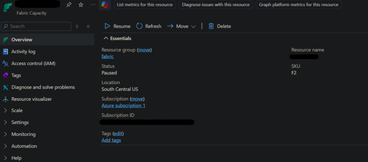\n</p>

Once the Fabric resource was deployed in Azure, I created a dedicated Fabric workspace for the solution.

---

## **2 — Define the Data Sources 📨**

**The project combines two sources.**

The first one is a historical dataset I had previously built containing Brasileirao standings from:

```text
2003–2022
```

The second source is a REST API provided by **sports.bzzoiro.com**, which exposes football league information. Whoever is behind this site is a lovely guy, because all the endpoints work perfectly and it is free, so thanks a LOT to him.

The missing seasons were:

```text
2023 → season_id 31
2024 → season_id 30
2025 → season_id 29
2026 → season_id 28
```

Before combining both sources, I wanted to verify that the API data was consistent with my historical dataset.

For example, according to both sources, Internacional finished the 2022 season in second place.

Using Postman and the `leagues` endpoint from sports.bzzoiro.com:

<p align="center">\n  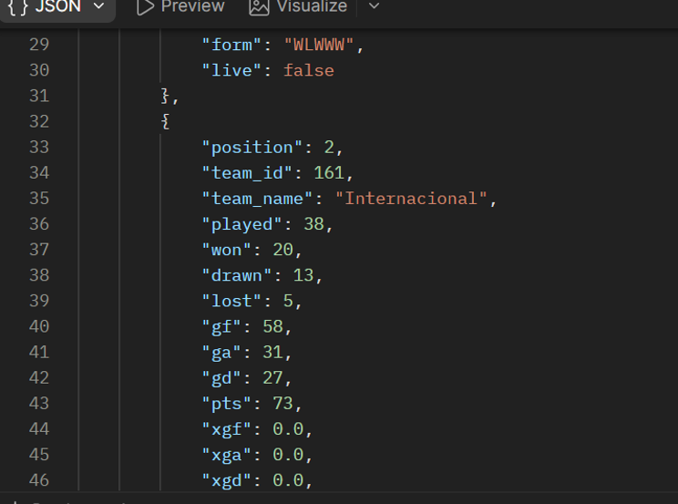\n</p>

Same information I have in the `.CSV` file:

<p align="center">\n  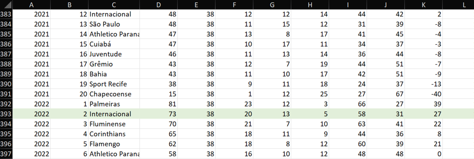\n</p>

---

## **3 — Create the Lakehouse 🌅**

The next step was creating the main Lakehouse:

```text
lakehouseBrasileirao
```

<p align="center">\n  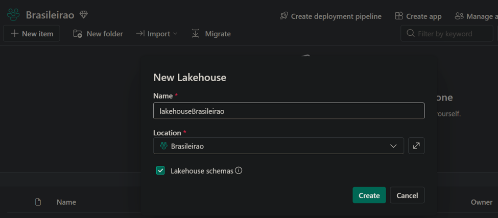\n</p>

The idea was to use OneLake as the central storage layer for both raw files and Delta tables.

<p align="center">\n  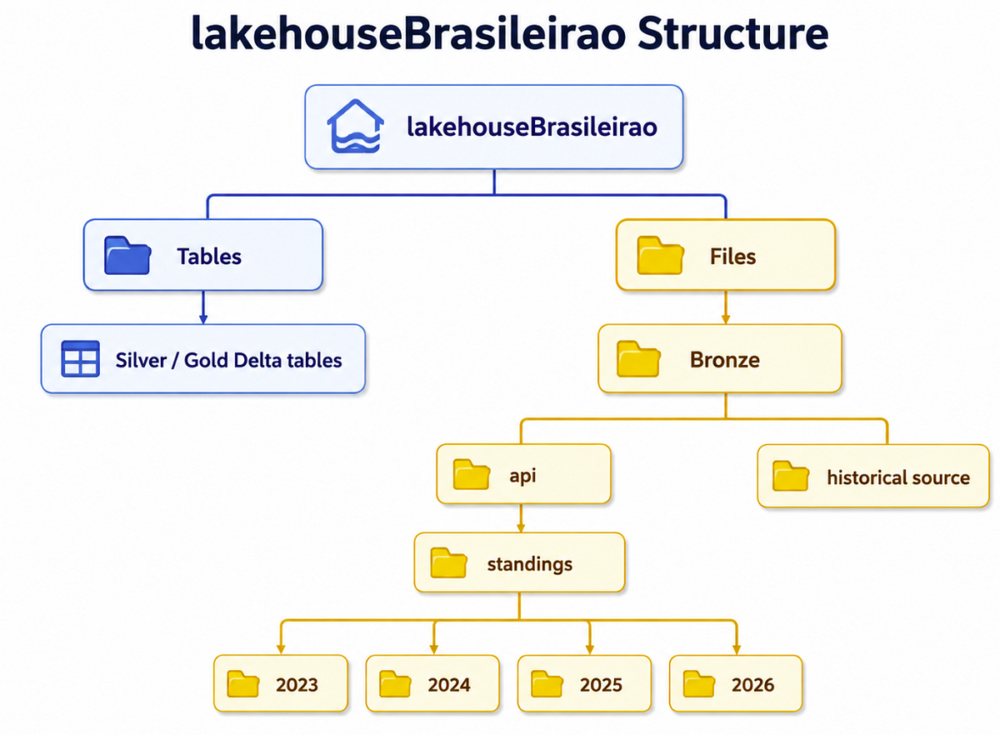\n</p>

**The basic idea was simple:**

```text
lakehouseBrasileirao
│
├── Tables
│   └── Silver / Gold Delta tables
│
└── Files
    └── Bronze
        ├── api
        │   └── standings
        │       ├── 2023
        │       ├── 2024
        │       ├── 2025
        │       └── 2026
        │
        └── historical source
```

`Files/Bronze` would contain the raw source information, while processed data would eventually become Delta tables.

---

## **4 — Load the Historical Data with Dataflow Gen2 ⏩**

For the historical **2003–2022** dataset, I didn't need Spark.

The data was already structured and only required some lightweight transformations, so **Dataflow Gen2** was a better fit.

I used it to:

- Load the Excel dataset
- Adjust column names
- Correct data types
- Create a normalized `teamName`
- Remove accents and special characters
- Write the result as a Delta table

**For example:**

<p align="center">\n  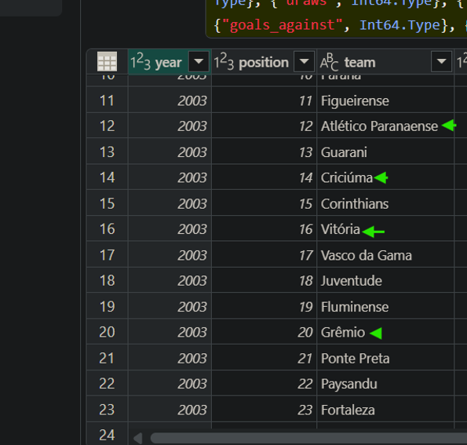\n</p>

Since historical seasons don't change, this process only needs to be executed once.

<p align="center">\n  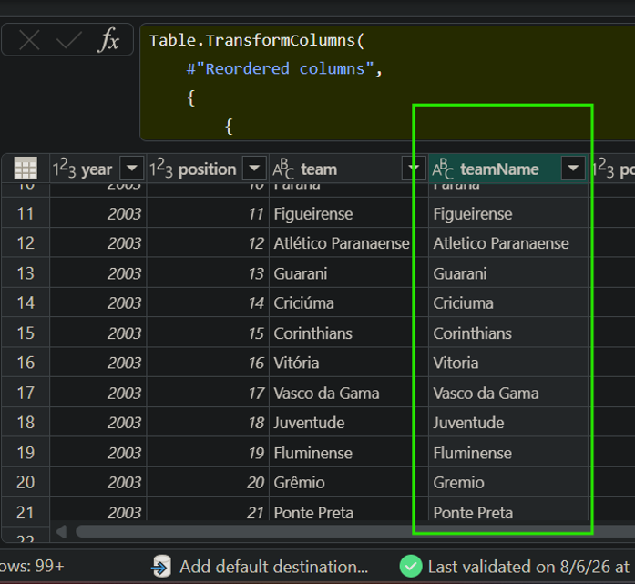\n</p>

Then you need to click **Save and run**.

<p align="center">\n  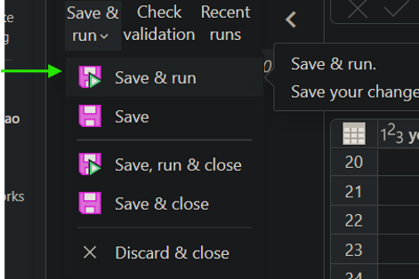\n</p>

<p align="center">\n  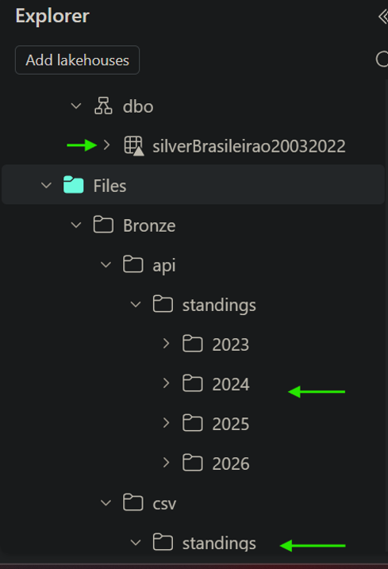\n</p>

---

## **5 — Build a Parameterized Ingestion Pipeline ⚙️**

Creating separate Copy Activities for every season would work, but it would also duplicate logic.

Instead, I created an array variable containing the seasons:

```json
[
  { "year": 2023, "season_id": 31 },
  { "year": 2024, "season_id": 30 },
  { "year": 2025, "season_id": 29 },
  { "year": 2026, "season_id": 28 }
]
```

Then I added a **ForEach** activity.

The ForEach iterates over the array and executes the same Copy Activity for every season.

Both the API request and the destination path became dynamic.

**Conceptually:**

```text
season_id = item().season_id
destination = Bronze/api/standings/{item().year}
```

This meant one pipeline could ingest all four seasons instead of creating four nearly identical activities.

<p align="center">\n  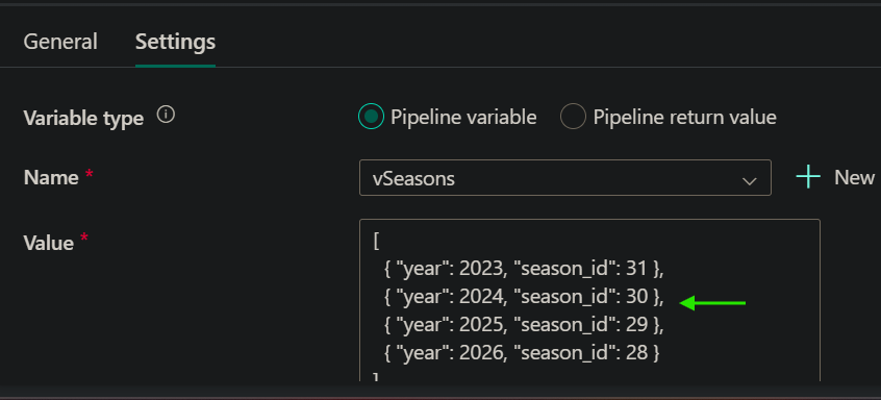\n</p>

<p align="center">\n  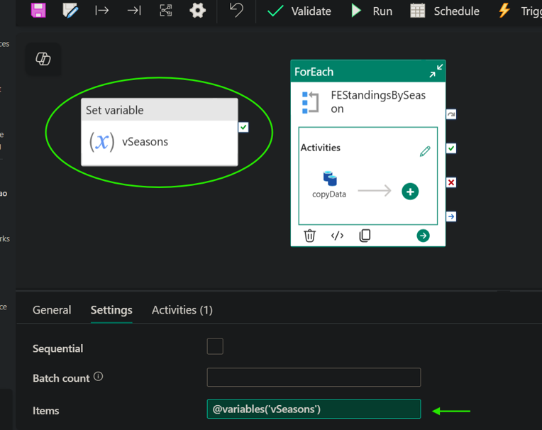\n</p>

<p align="center">\n  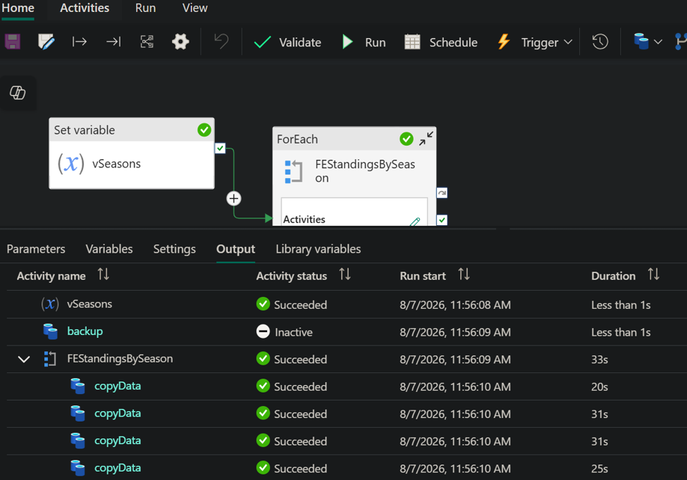\n</p>

---

## **6 — Store Raw API Data in the Bronze Layer 📚**

After executing the pipeline, Fabric produced:

```text
Bronze/api/standings/2023/standings.json
Bronze/api/standings/2024/standings.json
Bronze/api/standings/2025/standings.json
Bronze/api/standings/2026/standings.json
```

At this point, **2023–2025** became historical source data.

There was no reason to keep calling the API for those completed seasons.

Only **2026** would need recurring ingestion going forward.

<p align="center">\n  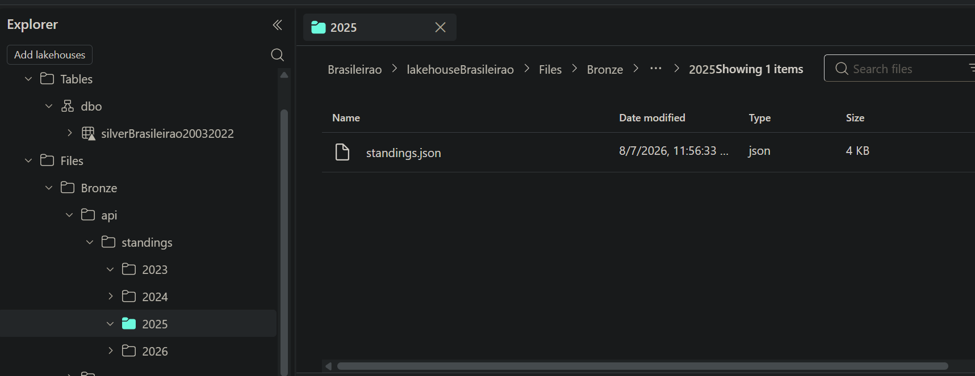\n</p>

---

## **7 — Transform the JSON with PySpark 🔨**

The next challenge was turning the nested JSON response into a tabular structure compatible with my historical data.

The API stores standings inside an array.

Using PySpark:

```python
from pyspark.sql import functions as F

df_standings = (
    df_raw
    .select(
        F.col("season.year").alias("year"),
        F.explode("standings").alias("standing")
    )
)
```

For three seasons with twenty teams each, the expected result was:

```text
3 seasons × 20 teams = 60 rows
```

<p align="center">\n  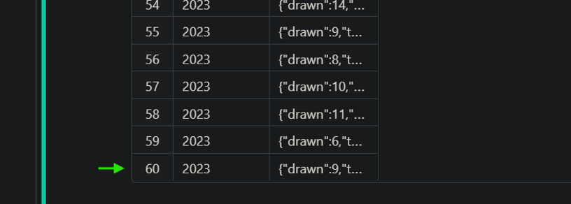\n</p>

Then I mapped the API fields into my historical schema:

```python
F.col("standing.position").alias("position")
F.col("standing.team_name").alias("team")
F.col("standing.pts").alias("points")
F.col("standing.played").alias("games")
F.col("standing.won").alias("victories")
F.col("standing.drawn").alias("draws")
F.col("standing.lost").alias("losses")
F.col("standing.gf").alias("goals_scored")
F.col("standing.ga").alias("goals_against")
F.col("standing.gd").alias("goals_difference")
```

The API contained additional fields, but I intentionally retained only the attributes shared by both historical and API datasets.

That gave me a consistent schema across the entire historical period.

---

## **8 — Normalize Team Names 📝**

Removing accents solved one problem, but not the most interesting one.

The same club could still have different names depending on the source or season.

**For example:**

```text
Atletico Paranaense
Athletico
Athletico Paranaense
```

These values refer to the same entity.

Other inconsistencies appeared with teams such as Bragantino and Sport.

Because the dataset contained a manageable number of teams, I reviewed the distinct names and applied explicit mappings.

<p align="center">\n  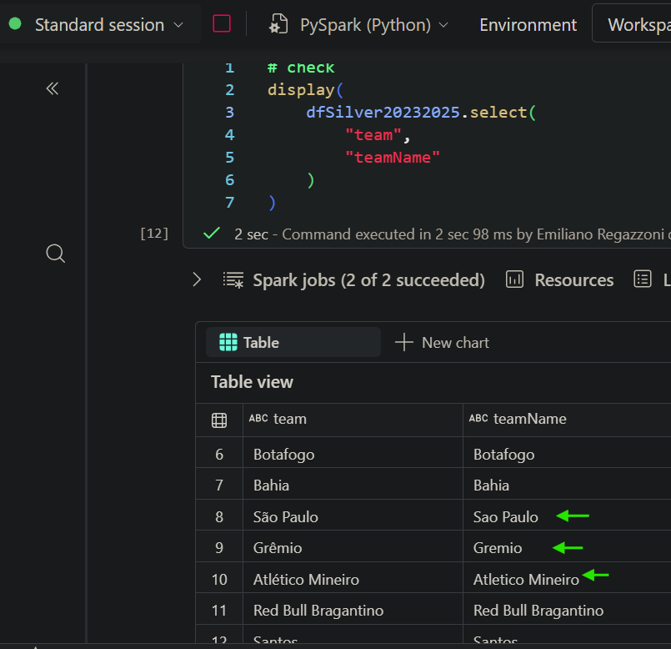\n</p>

> **One of the most useful lessons in the project:** matching schemas doesn't guarantee matching entities. Data integration requires semantic normalization too.

---

## **9 — Build the Consolidated Silver Historical Table ⚪️**

At this point I had two Silver datasets:

```text
2003–2022
2023–2025
```

After aligning their schemas and standardizing team names, I combined them into a single Delta table:

```text
silverBrasileiraoHistorical
```

The final historical dataset covers:

```text
2003–2025
```

I intentionally kept **2026** outside this table.

A completed historical season and an in-progress season represent different analytical states, so separating them keeps the model clearer.

<p align="center">\n  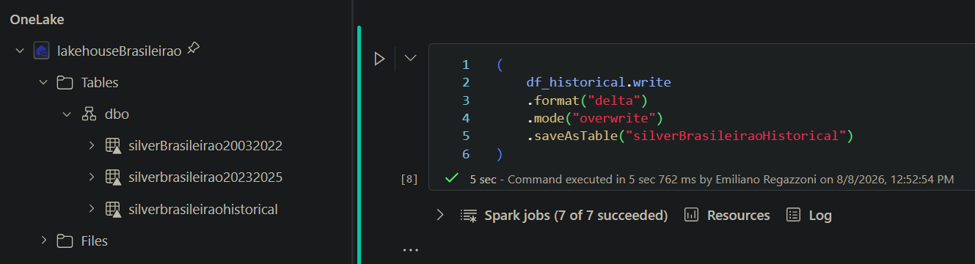\n</p>

---

## **10 — Build the Gold Layer 🟡**

For the Gold layer, I moved toward a basic dimensional model.

First, I extracted the unique teams:

```text
teamKey
teamName
```

and created:

```text
goldDimTeams
```

Then I joined `teamKey` back into the historical dataset and created:

```text
goldBrasileiraoHistorical
```

The Gold layer now contained structures ready for analytics.

<p align="center">\n  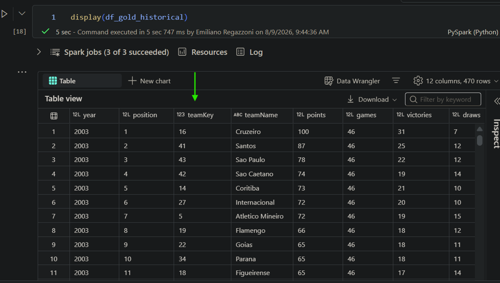\n</p>

---

## **11 — Create the 2026 Current-Season Pipeline 🔀**

The current season required a different lifecycle.

For **2026** I decided to ingest two API datasets:

- Current standings
- Current top scorers

<p align="center">\n  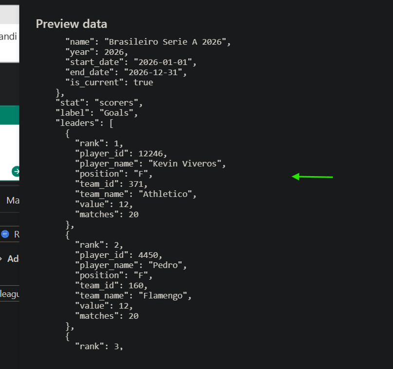\n</p>

**The pipeline contains two Copy Activities:**

<p align="center">\n  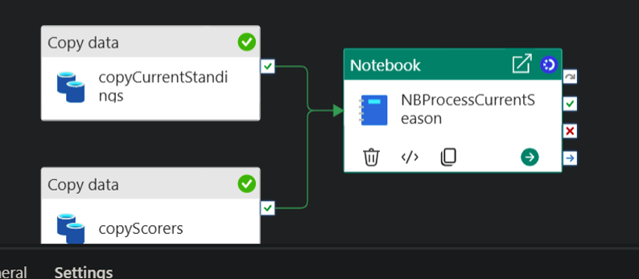\n</p>

```text
Copy current standings ─┐
                        ├──> NBProcessCurrentSeason
Copy current scorers ───┘
```

Both extractions can execute in parallel.

The notebook only runs after both API calls succeed.

This creates the processed current-season datasets needed for reporting.

---

## **12 — Schedule the 2026 Refresh ♻️**

Historical data doesn't need recurring ingestion.

**2026 does.**

I configured the current-season pipeline to execute **weekly on Monday**.

<p align="center">\n  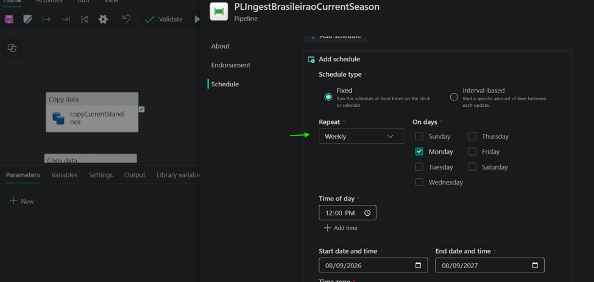\n</p>

The pipeline retrieves the latest `standings.json` and `scorers.json` and overwrites the current snapshot.

<p align="center">\n  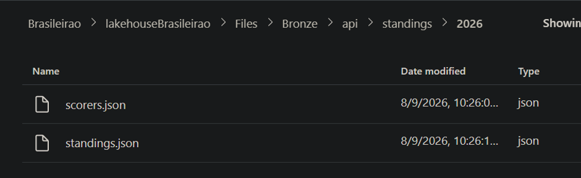\n</p>

For this project I didn't need historical weekly snapshots of 2026; I only wanted the latest league state.

So the recurring process stays intentionally simple:

```text
API
 ↓
Bronze JSON
 ↓
PySpark
 ↓
Current tables
```

---

## **13 — Load the Data into Fabric Warehouse 📆**

Although the Gold Delta tables could already serve analytical workloads, I also wanted to include **Fabric Warehouse** in the project.

I created a Warehouse containing four main tables:

```text
dimTeam
dimBrasileirao
brasileiraoCurrent
scorers
```

> `dimBrasileirao` should conceptually be called a fact table rather than a dimension, but I kept the original name used during the lab.

**The historical tables are loaded once.**

**The current tables are refreshed weekly after the API pipeline runs.**

<p align="center">\n  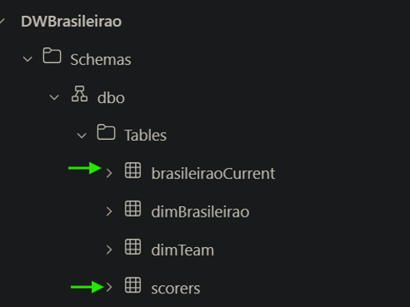\n</p>

---

## **14 — Create the Direct Lake Semantic Model**

From the serving layer I created:

```text
SMBrasileiraoAnalytics
```

using **Direct Lake on OneLake**.

The semantic model became the business layer used by Power BI.

I added relationships and measures to create the visuals.

---

## **15 — Build the Historical Power BI Report 📊**

The first report page focuses on **2003–2025**.

Some of the metrics include:

- Championships by team
- Top five teams by historical points
- Number of seasons analyzed
- Number of teams
- Total historical goals

<p align="center">\n  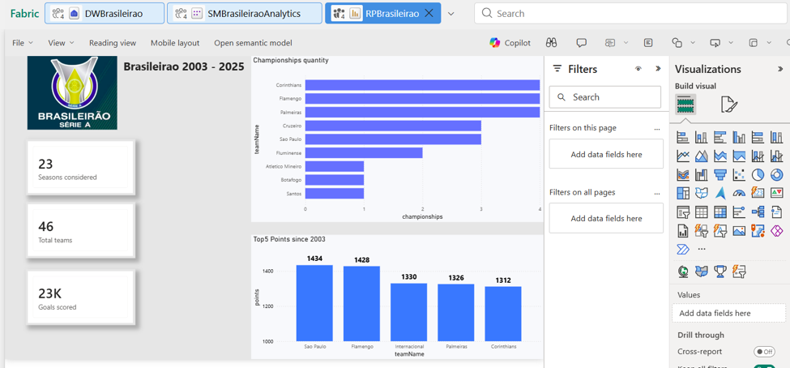\n</p>

One result initially surprised me: **more than 23,000 goals**.

Instead of assuming the report was wrong, I checked in the Warehouse and verified the total.

<p align="center">\n  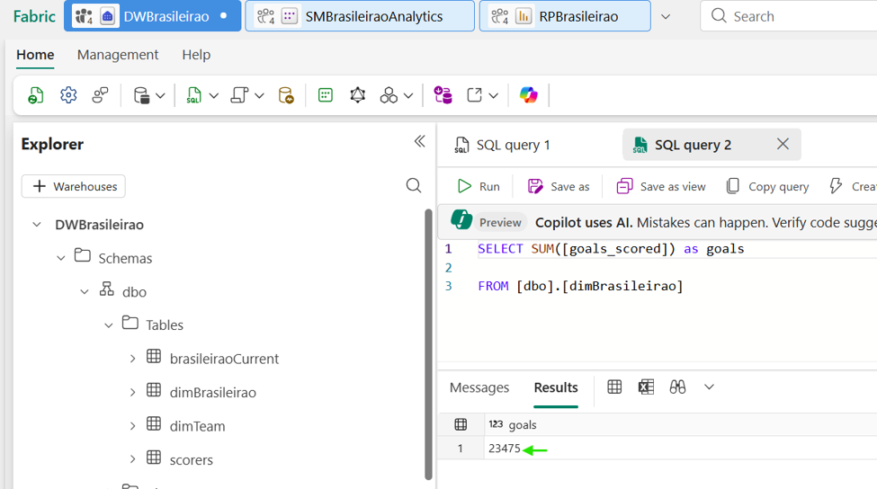\n</p>

It was correct.

> **Another useful lesson:** unexpected data deserves validation, not immediate rejection.

---

## **16 — Build the 2026 Report**

The second report page is dedicated to the current season.

It includes:

- Current league standings
- Points
- Matches
- Wins, draws and losses
- Goals for
- Goals against
- Goal difference
- Current top scorer
- Average goals
- Points-per-game metrics

Because this page is connected to the recurring 2026 process, the values change as the weekly pipeline refreshes the data.

<p align="center">\n  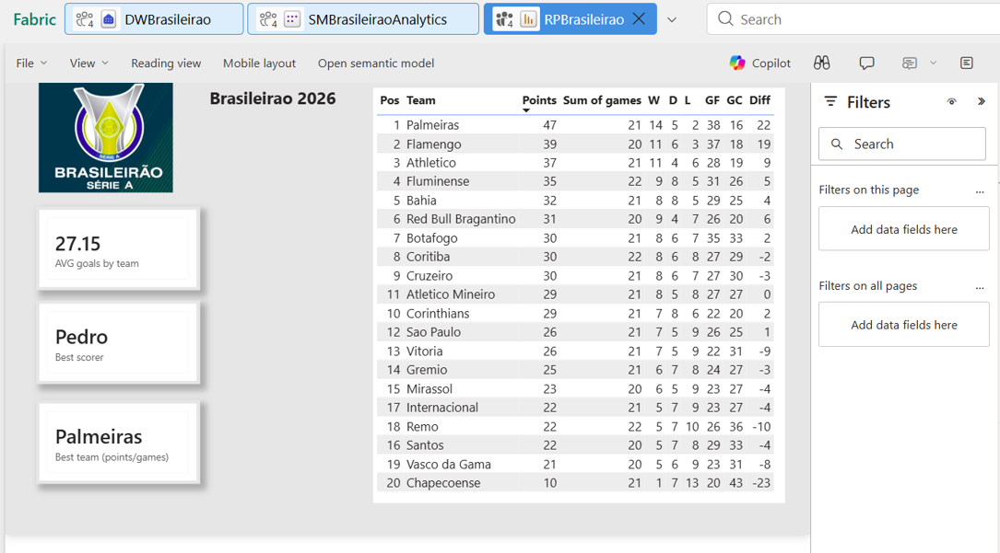\n</p>

Finally, the map of the solution is something like this:

<p align="center">\n  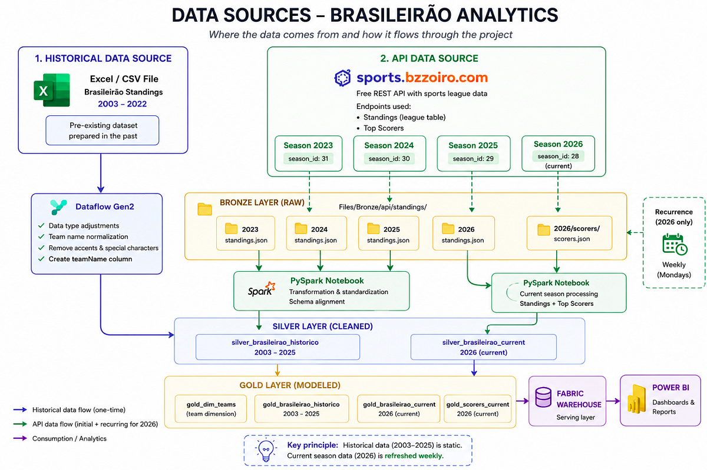\n</p>

---

## **17 — Integrate Microsoft Fabric with GitHub 🛠**

The last major step was adding source control.

I enabled GitHub integration at the Fabric tenant level and then connected the workspace to my repository.

The first step was going to the **Admin Portal** in Fabric.

<p align="center">\n  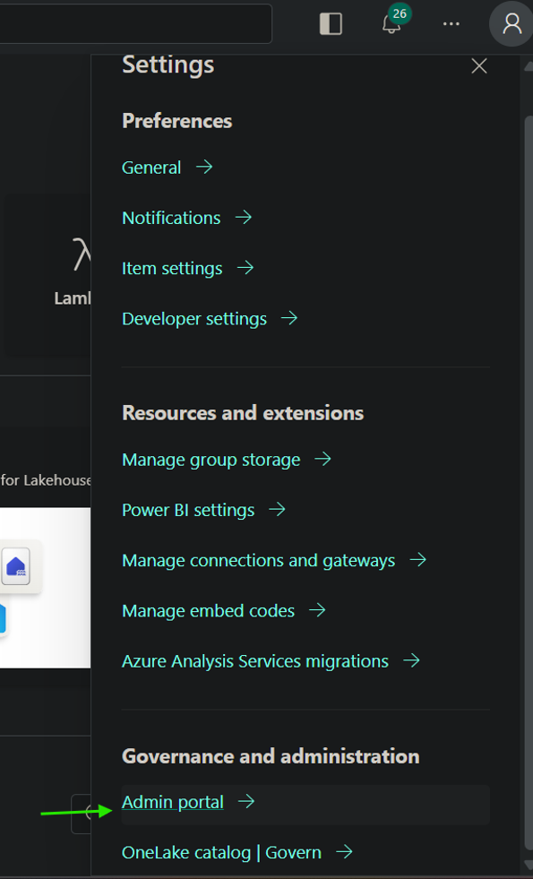\n</p>

Enable the GitHub integration option:

<p align="center">\n  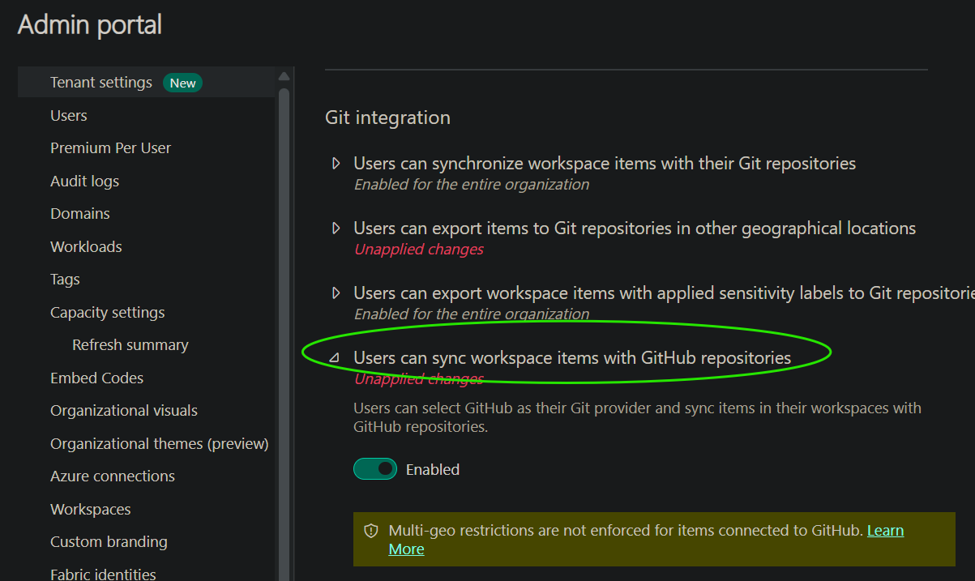\n</p>

After some minutes I could click on the GitHub option:

<p align="center">\n  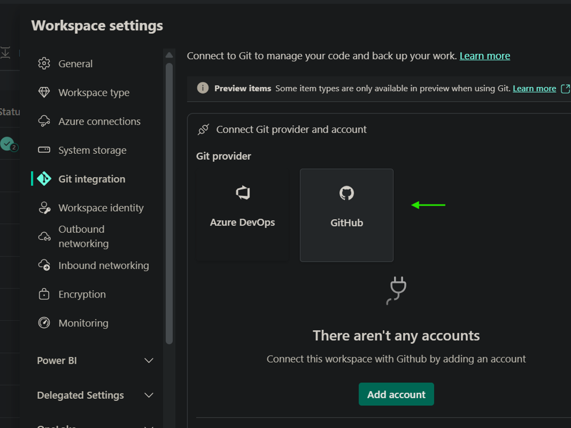\n</p>

I connected my GitHub account:

<p align="center">\n  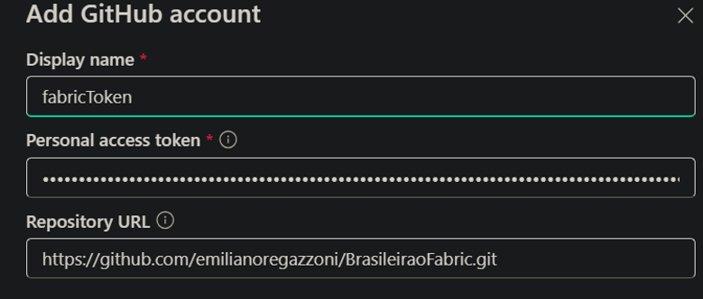\n</p>

Then the repository was synced:

<p align="center">\n  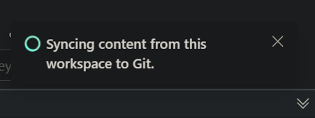\n</p>

After that, each item had a new **Git status** column:

<p align="center">\n  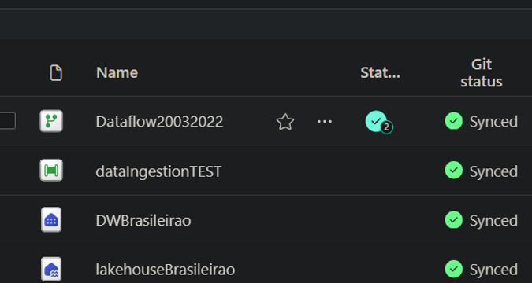\n</p>

---

## **Final Thoughts**

After completing this lab, I think **Microsoft Fabric can be a very good option for small and medium companies that are starting their cloud journey**.

What I liked the most is how easy it is to connect the different pieces of the data platform without having to jump between many separate services.

This lab also showed me that you can build a complete data pipeline without making the architecture unnecessarily complicated.

In my case, I started with a historical Excel dataset and a REST API, and ended up with an automated solution that includes **ingestion, transformation, modeling, reporting and source control**.

---

## **Acknowledgements**

A special thanks to the creator of **sports.bzzoiro.com** for making this kind of sports data easily accessible for learning and experimentation. 😁

I also used **GPT-5.5** as a development assistant during the project, mainly to support the creation and debugging of PySpark/Python code, DAX measures, and some architectural decisions while building the solution.

---

## **Tech Stack**

`Microsoft Fabric` · `OneLake` · `Lakehouse` · `Dataflow Gen2` · `Data Factory Pipelines` · `PySpark` · `Delta Lake` · `Fabric Warehouse` · `Direct Lake` · `Power BI` · `GitHub`
